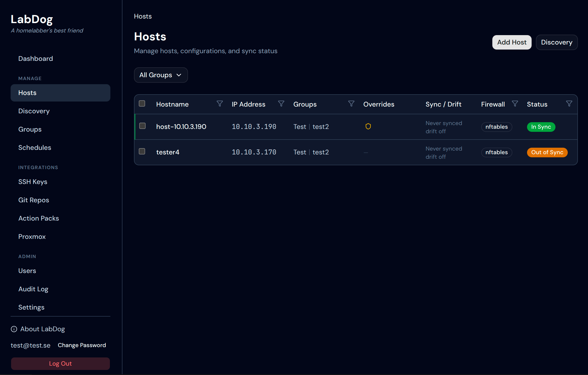
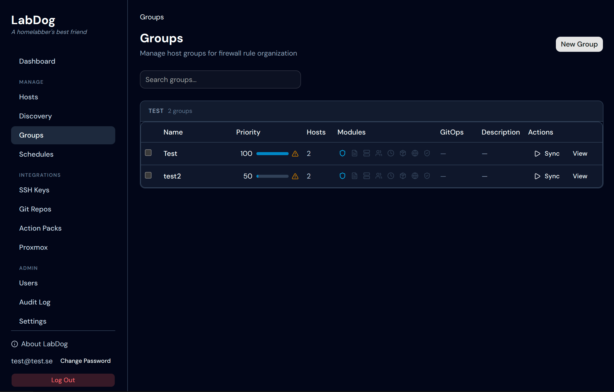
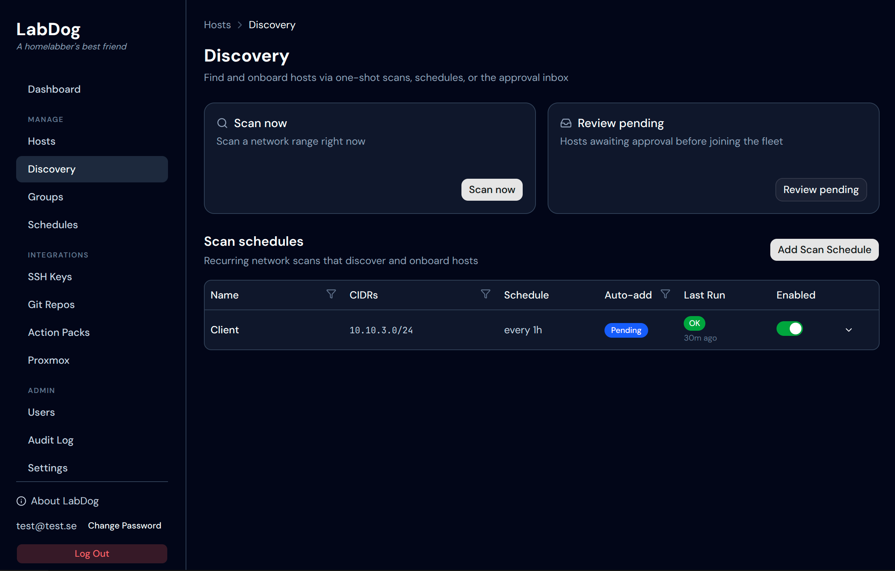

<p align="left">
  
</p>

# LabDog

[](https://github.com/open-labdog/labdog/actions/workflows/ci.yml)
[](https://github.com/open-labdog/labdog/releases/latest)
[](https://hub.docker.com/r/openlabdog/labdog)
[](https://open-labdog.github.io/labdog/)
[](LICENSE)

Manage firewall rules, systemd services, `/etc/hosts`, packages, users and more from a single web UI. Declare state in groups, preview the exact Ansible diff before applying, detect drift, and roll it back if something looks wrong.

## Try it in 30 seconds

```bash
docker run -d --name labdog -p 8000:8000 \
  -v labdog-data:/var/lib/labdog \
  openlabdog/labdog:latest
```

Then open <http://localhost:8000> and register the first admin user.

→ **[Docker Hub](https://hub.docker.com/r/openlabdog/labdog)** for image tags, signed digests, and `compose` examples

→ **[Full installation guide](https://open-labdog.github.io/labdog/#installation)** — `.deb`, `.rpm`, tarball, or Docker

## 📦 Install

The Docker command above is the fastest path — see [`openlabdog/labdog`](https://hub.docker.com/r/openlabdog/labdog) on Docker Hub for image tags, signed digests, and `compose` examples. For `.deb` / `.rpm` / tarball / from source, see the **[installation guide](https://open-labdog.github.io/labdog/#installation)**.

## ✨ What you get

**Configuration modules** &nbsp;`firewall` · `services` · `hosts` · `packages` · `users` · `cron` · `dns-resolver`

Declare state per host or per group. Everything goes through Ansible. Same rule format for nftables and iptables.

**Operations** &nbsp;`plan` · `apply` · `drift` · `audit`

- **Plan-before-apply** — see the exact diff before pushing changes
- **Coalesced sync** — one playbook per host covering every requested module; PostgreSQL-serialised so concurrent module syncs never race over SSH
- **Drift detection** — periodic + on-demand, across every module
- **Audit trail** — append-only, before / after state, every action

**Safety rails**

- SSH lockout prevention (auto-injected system rule)
- Protected service deny-list (sshd, systemd-\*)
- Priority-based merge with host-level overrides

**Extensibility**

- **GitOps** — webhook-driven sync from any Git repo (see the [YAML schema](https://open-labdog.github.io/labdog/examples/gitops/))
- **Action packs** — BYO Ansible playbooks as one-click actions
- **Scheduled actions** — cron-driven runs with optional Proxmox snapshot + verify + auto-rollback

**Integrations**

- **Ansible** — every change is applied via `ansible-runner`; standard playbook YAML, no LabDog-specific DSL
- **SSH** — push config to hosts and serve an in-browser terminal (asyncssh + xterm.js)
- **Git** — pull GitOps configs and Action packs from any Git server; SSH key or HTTPS PAT auth, credentials encrypted at rest
- **Proxmox VE** — automatic snapshot + rollback, VM discovery
- **Grafana Mimir/Loki** — register a Prometheus-compatible endpoint to show instant CPU/memory/disk on the host page; ties into the bundled Alloy install action so metrics flow back automatically
- **Webhooks** — inbound triggers from your Git host for GitOps sync

## 🖼️ Screenshots

<p>
  
  <em>Hosts — every managed host with its sync status, firewall backend, and group membership at a glance.</em>
</p>

<p>
  
  <em>Groups — host groups carry the desired-state config that merges by priority; sync per group or fleet-wide.</em>
</p>

<p>
  
  <em>Discovery — scan a CIDR or schedule recurring sweeps; pending hosts queue for review before joining the fleet.</em>
</p>

## 📚 Documentation

All technical content lives under **[the documentation site](https://open-labdog.github.io/labdog/)**:

- **Concepts** — [how config is applied](https://open-labdog.github.io/labdog/#how-configuration-is-applied) · [precedence (worked examples)](https://open-labdog.github.io/labdog/examples/precedence/)
- **Operations** — [installation](https://open-labdog.github.io/labdog/#installation) · [local development](https://open-labdog.github.io/labdog/#local-development) · [API reference](https://open-labdog.github.io/labdog/#api-endpoints)
- **Guides** — [GitOps](https://open-labdog.github.io/labdog/examples/gitops/) · [Actions & packs](https://open-labdog.github.io/labdog/ui/actions/) · [example packs](https://open-labdog.github.io/labdog/examples/action-packs/) · [Scheduled actions](https://open-labdog.github.io/labdog/ui/scheduled-actions/) · [Live host metrics](https://open-labdog.github.io/labdog/ui/metrics/)

## 🐛 Found a bug?

See **[BUGS.md](BUGS.md)** for known issues and **[CONTRIBUTING.md](CONTRIBUTING.md)** to file a new report or send a patch. Security-sensitive issues: **[SECURITY.md](SECURITY.md)**.

## 📜 License

**AGPL-3.0-or-later.** See [LICENSE](LICENSE). The network-use clause means anyone running a modified version of LabDog as a service must make the source of their modifications available to its users. Private internal deployments without modifications carry no extra obligations.

Copyright © 2026 Dennis Tyresson and contributors.
