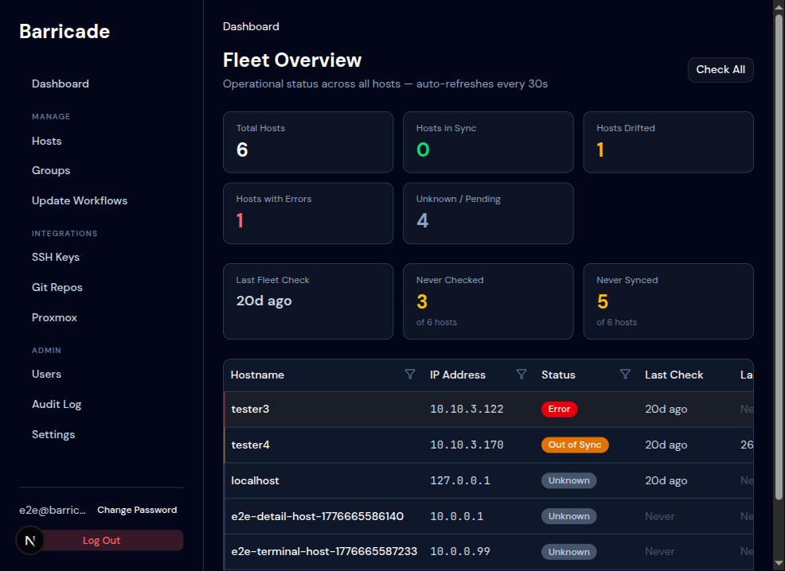

# Dashboard

**Path:** `/dashboard`

Fleet-wide health overview. Heading reads **Fleet Overview**; the page
auto-refreshes every 30 seconds.

## Metric Cards

Two rows of summary cards at the top:

**Triage tier**

| Card | What it shows |
|------|---------------|
| **Total Hosts** | All hosts registered in LabDog |
| **Hosts in Sync** | Hosts whose current state matches desired state |
| **Hosts Drifted** | Hosts where actual state has diverged from desired |
| **Hosts with Errors** | Hosts where the last sync or drift check failed |
| **Unknown / Pending** | Hosts not yet checked or with a check in flight |

**Coverage tier**

| Card | What it shows |
|------|---------------|
| **Last Fleet Check** | Relative time since the most recent host drift check |
| **Never Checked** | Hosts with no drift-check history |
| **Never Synced** | Hosts that have never had Ansible applied |

## Host Table

Below the cards, a table lists every host with its IP address, current
status badge, **Last Check**, and **Last Sync** timestamps. Rows are
sorted by triage priority (errors first). Click the hostname to open
the host detail page.

**Status badges:**

| Badge | Meaning |
|-------|---------|
| `In Sync` (green) | All modules match desired state |
| `Out of Sync` (amber) | At least one module has drifted |
| `Error` (red) | Last check or sync returned an error |
| `Unknown` (grey) | Host has never been checked |

Each row also has a **Collect** button that re-runs state collection
for that single host.

## Collect State

The **Collect State** button in the top-right SSHes into every host
and refreshes its **current state** in LabDog's database. This is
distinct from:

- the **Last Check** column (drift detection — diff against desired state)
- the **Last Sync** column (Ansible push — apply desired state)

State collection feeds both views: it's the read step that makes the
drift comparison and the dashboard's status badges accurate.
