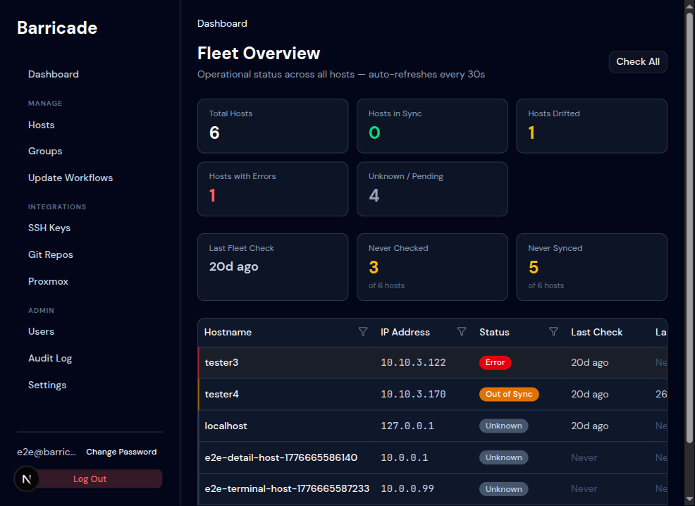

# Dashboard

**Path:** `/dashboard`

Fleet-wide health overview. Heading reads **Fleet Overview**; the page
auto-refreshes every 30 seconds.

## Metric Cards

Two rows of summary cards at the top:

**Triage tier**

| Card | What it shows |
|------|---------------|
| **Total Hosts** | All hosts registered in LabDog |
| **Hosts in Sync** | Hosts whose current state matches desired state |
| **Hosts Drifted** | Hosts where actual state has diverged from desired |
| **Hosts with Errors** | Hosts where the last sync or drift check failed |
| **Unknown / Pending** | Hosts not yet checked or with a check in flight |

**Coverage tier**

| Card | What it shows |
|------|---------------|
| **Last Fleet Check** | Relative time since the most recent host drift check |
| **Never Checked** | Hosts with no drift-check history |
| **Never Synced** | Hosts that have never had Ansible applied |

## Charts and feeds

Below the cards sit two rows of panels. All four share a fixed height
and refresh on the same 30-second cycle as the rest of the page.

| Panel | What it shows |
|-------|---------------|
| **Sync Success Rate** | Share of syncs that succeeded, bucketed by day over the last 7 days. Sourced from LabDog's full sync-job history, so it has data immediately. |
| **Drift Trend** | Drift checks that found a host out of sync, per day over the last 7 days, with total drift volume in the tooltip. |
| **Recent Activity** | The last 10 audit events — config and operator changes. "View all" opens the full [Audit Log](admin.md#audit-log). |
| **Recent Scheduled Runs** | Runs dispatched from a schedule. Defaults to one row per run; the **Grouped** toggle collapses them to one row per schedule with a status strip you can expand. |

**Drift Trend starts empty, and that is expected.** LabDog only stores
each host's *current* drift state, so trend history had to be recorded
going forward rather than reconstructed. The chart shows "Drift history
is being collected" until the first drift checks run, then fills in.

If it stays empty, the usual cause is that **drift checking is disabled**
— it is off by default on every host. Enable it per host on the Host
detail page, or for many hosts at once from the [Hosts](hosts.md) list.
A chart reading "No drift detected" (green) is the opposite situation:
checks are running and finding nothing.

## Host Table

Below the panels, a table lists hosts with IP address, current status
badge, **Last Check**, and **Last Sync** timestamps. Click the hostname
to open the host detail page.

The table shows the **top 10** hosts, and a selector above it chooses
which 10:

| Option | Ordering |
|--------|----------|
| **Needs attention** (default) | Triage priority — errors first, then drifted, pending, unknown, in sync |
| **Recently synced** | Most recently synced first |
| **Stalest sync** | Longest since last sync; never-synced hosts first |
| **Longest since check** | Longest since last drift check; never-checked first |
| **Recently drifted** | Drifted hosts, most recently confirmed first |
| **Never checked** | Only hosts with no drift-check history |
| **Errors only** | Only hosts in an error state |
| **Newest hosts** | Most recently added first |

**View all hosts** opens the full [Hosts](hosts.md) list, which is not
capped.

**Status badges:**

| Badge | Meaning |
|-------|---------|
| `In Sync` (green) | All modules match desired state |
| `Out of Sync` (amber) | At least one module has drifted |
| `Error` (red) | Last check or sync returned an error |
| `Unknown` (grey) | Host has never been checked |

Each row also has a **Collect** button that re-runs state collection
for that single host.

## Collect State

The **Collect State** button in the top-right SSHes into every host
and refreshes its **current state** in LabDog's database. This is
distinct from:

- the **Last Check** column (drift detection — diff against desired state)
- the **Last Sync** column (Ansible push — apply desired state)

State collection feeds both views: it's the read step that makes the
drift comparison and the dashboard's status badges accurate.
