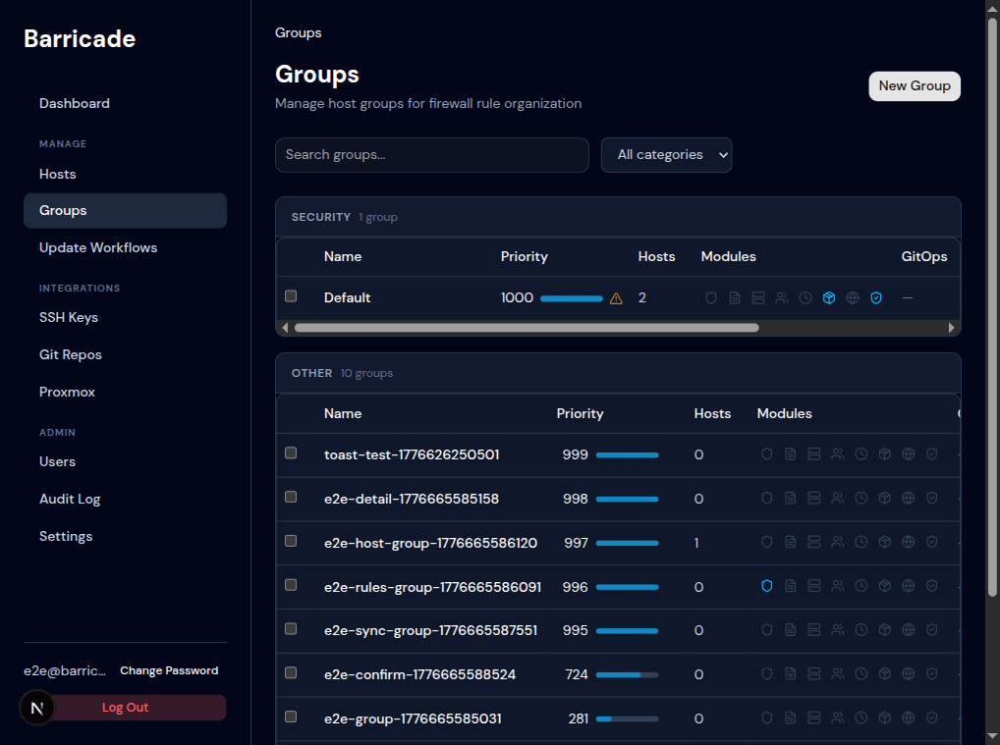
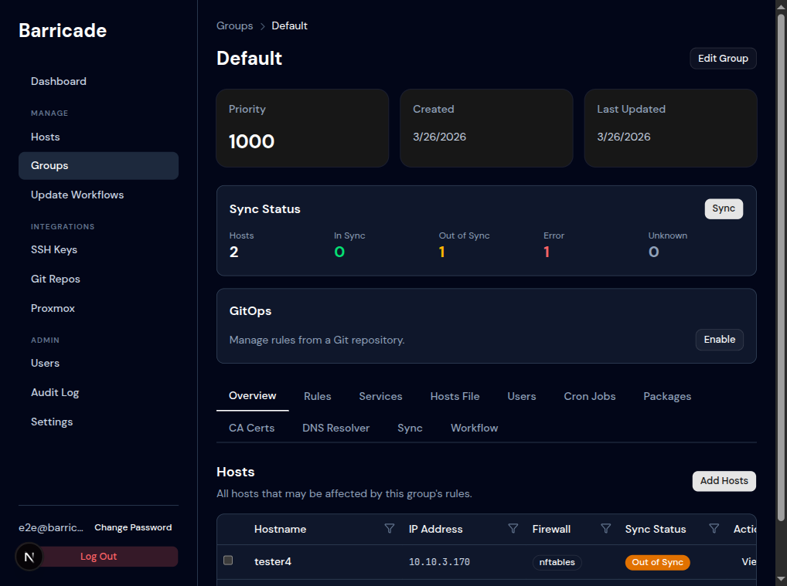
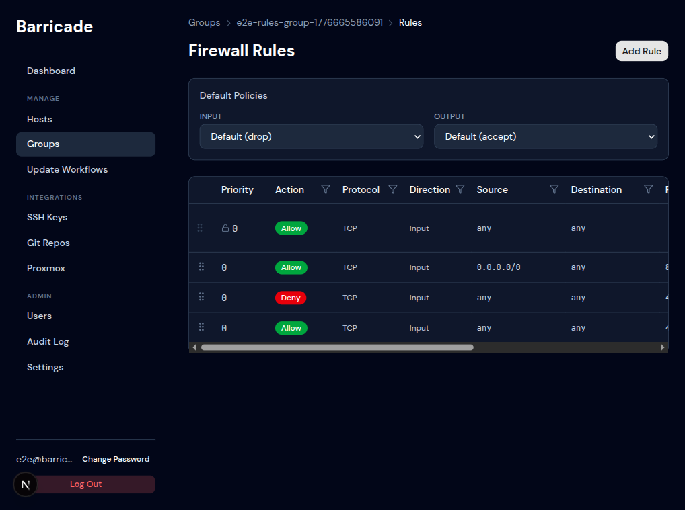
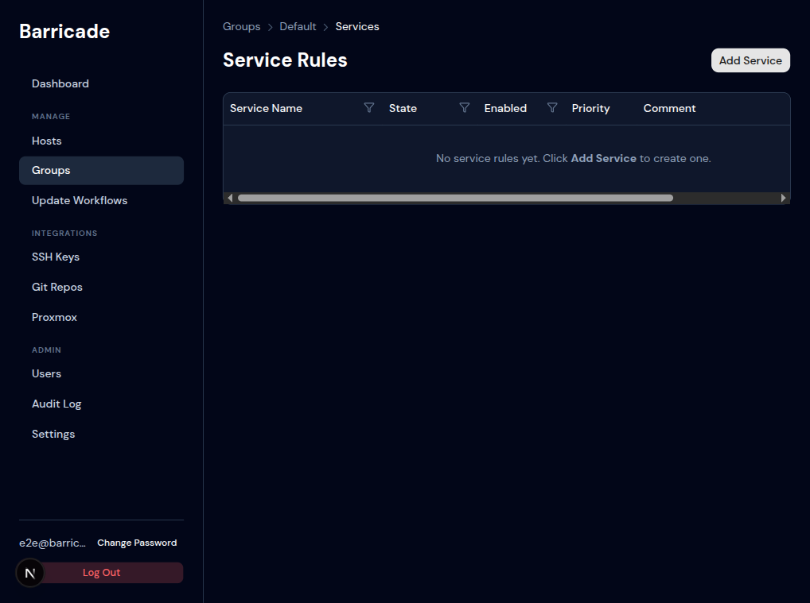
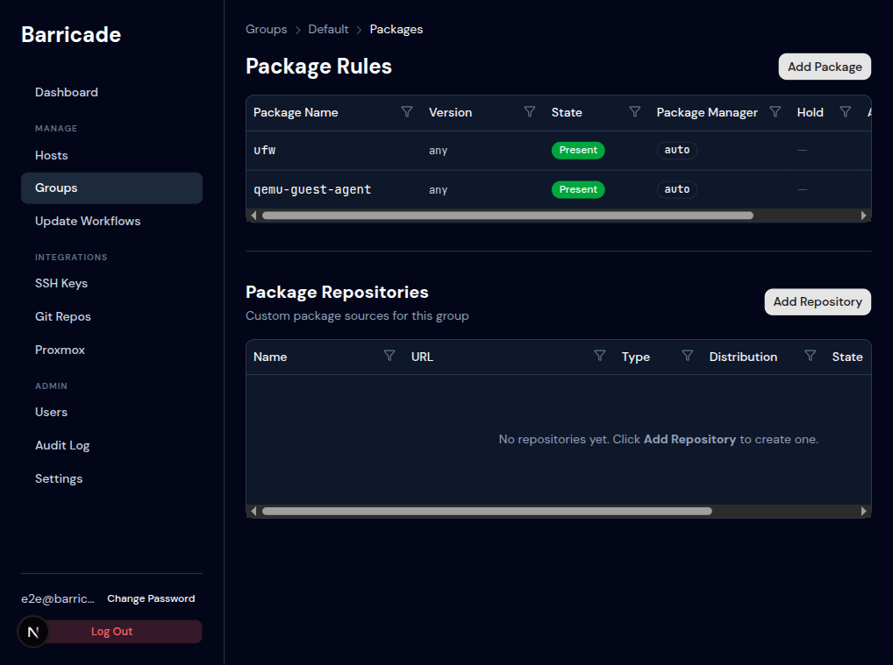
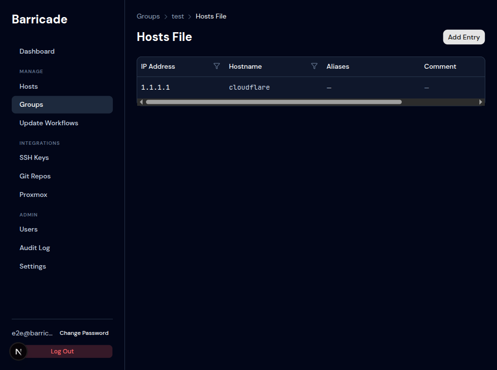
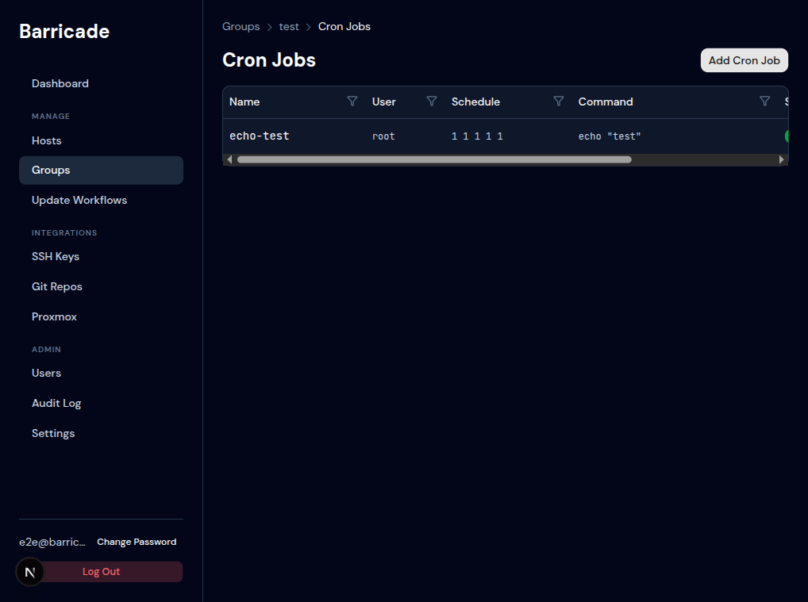
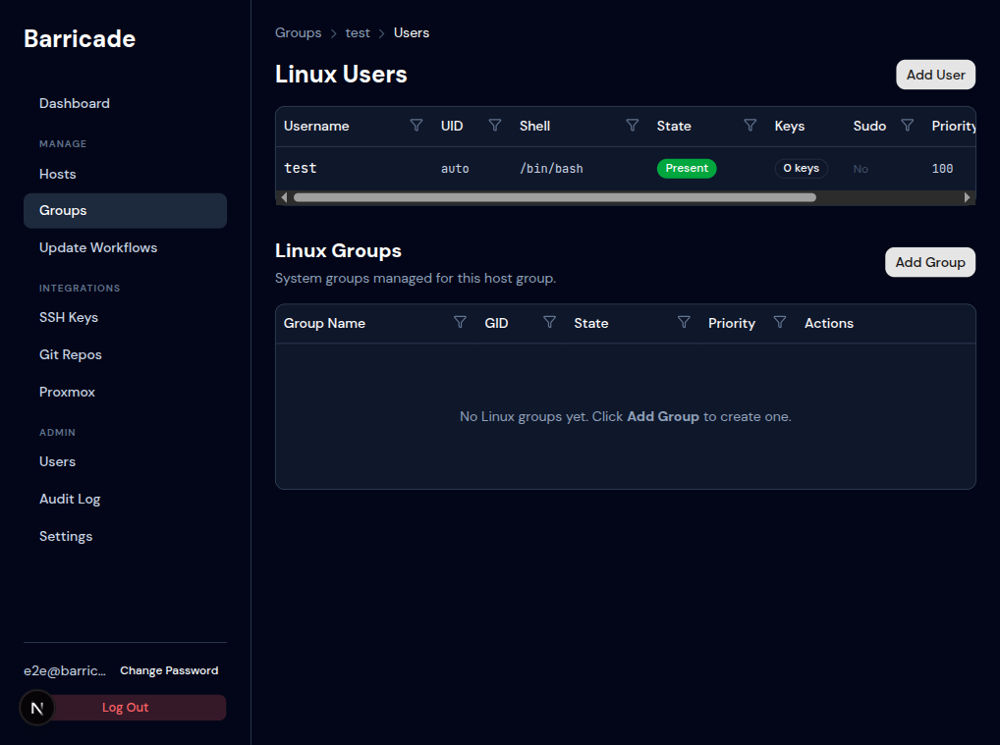
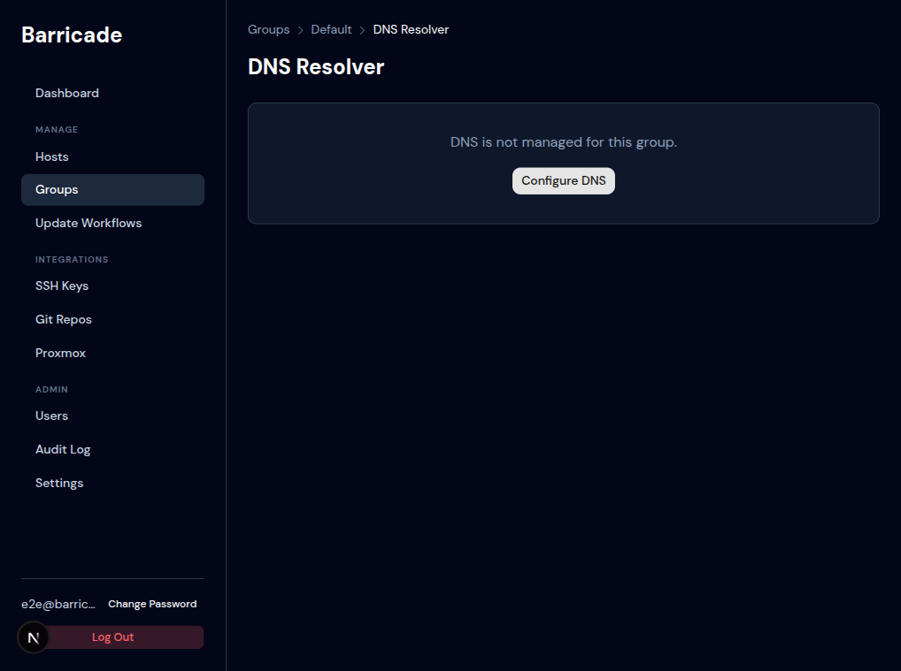
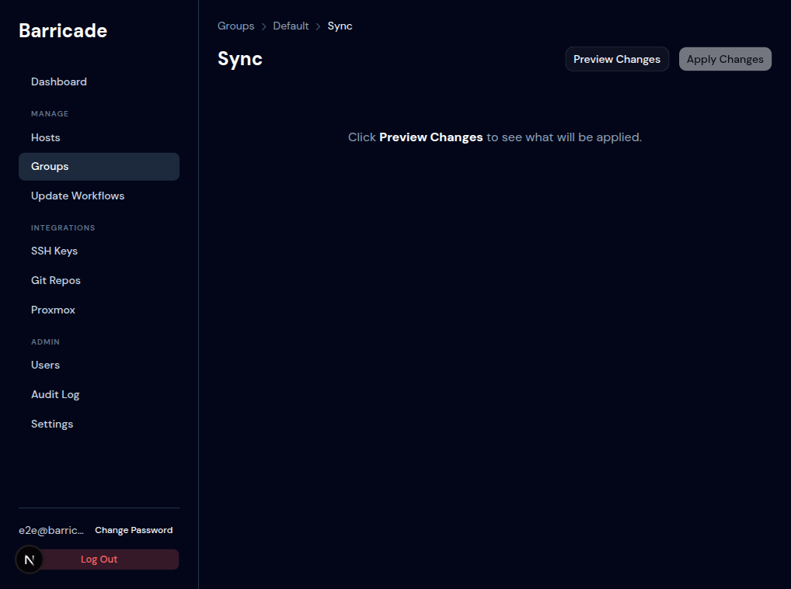

# Groups

## Groups List

**Path:** `/groups`

Groups are the core organisational unit in Barricade. Each group holds desired-state configuration for one or more modules. Hosts belong to groups, and when a host belongs to multiple groups, configurations are merged by priority (higher number wins).

### Columns

| Column | Description |
|--------|-------------|
| Name | Group name |
| Priority | Higher number = higher precedence in merges |
| Hosts | Number of hosts assigned to this group |
| Modules | Icon row showing which modules have config in this group |
| GitOps | Whether this group is controlled by a Git repository |

### Categories

Groups are displayed in collapsible category sections. The category is set when creating or editing a group. Uncategorised groups appear under **Other**.

### Creating a Group

Click **New Group**. Fields:

| Field | Notes |
|-------|-------|
| Name | Unique identifier for this group |
| Priority | `1`–`9999`. Higher wins in merges. |
| Category | Optional label for visual grouping |
| Description | Free-text note |

---

## Group Detail

**Path:** `/groups/{id}`

Shows the group's metadata, sync status summary, GitOps status, and tabs for every configuration module.

### Sync Status Card

| Metric | Description |
|--------|-------------|
| Hosts | Total hosts in this group |
| In Sync | Hosts where all modules match desired state |
| Out of Sync | Hosts where at least one module has drifted |
| Error | Hosts where the last check failed |
| Unknown | Hosts never checked |

The **Sync** button in the top-right of the card triggers an immediate sync for all hosts in the group.

### GitOps Card

Shows whether this group is managed by a Git repository. Click **Enable** to link a repository — after enabling, all module configuration for this group becomes read-only in the UI (a banner replaces the Add/Edit/Delete controls). See [GitOps UI](gitops-ui.md).

### Module Tabs

| Tab | Page |
|-----|------|
| Overview | Hosts table + GitOps status |
| Rules | [Firewall Rules](#firewall-rules) |
| Services | [Service Rules](#services) |
| Hosts File | [/etc/hosts entries](#hosts-file) |
| Users | [Linux Users & Groups](#linux-users) |
| Cron Jobs | [Cron Jobs](#cron-jobs) |
| Packages | [Packages](#packages) |
| CA Certs | CA certificate deployment |
| DNS Resolver | [DNS Resolver](#dns-resolver) |
| Sync | [Sync & Preview](#sync) |
| Workflow | [Update Workflows](workflows.md) |

---

## Firewall Rules

**Path:** `/groups/{id}/rules`

Manages the desired firewall state for all hosts in this group.

### Default Policies

At the top of the page, two dropdowns set the **default input** and **default output** policies:

- `Default (drop)` — block all traffic not explicitly allowed (recommended for input)
- `Default (accept)` — allow all traffic not explicitly denied

### Rule Table

Each rule row shows:

| Column | Description |
|--------|-------------|
| Priority | Rules are applied in priority order (lower number first) |
| Action | `Allow` (green) or `Deny` (red) |
| Protocol | `TCP`, `UDP`, `ICMP`, or `any` |
| Direction | `Input` or `Output` |
| Source | Source IP or CIDR (`any` = unrestricted) |
| Destination | Destination IP or CIDR |
| Port | Port number or range (`22`, `8000-8080`) |
| Comment | Optional note |

The lock icon (🔒) on priority `0` rules marks the auto-generated SSH lockout rule — Barricade always injects this to prevent locking itself out.

Rows can be reordered by dragging the handle on the left.

### Adding a Rule

Click **Add Rule**. All fields except Comment are required. Port is only shown for TCP/UDP.

---

## Services

**Path:** `/groups/{id}/services`

Defines which systemd services should be running (or stopped) and enabled (or disabled) on all hosts in this group.

### Columns

| Column | Description |
|--------|-------------|
| Service Name | The systemd unit name, e.g. `nginx.service` (`.service` suffix optional) |
| State | `running` or `stopped` |
| Enabled | Whether the unit is enabled at boot |
| Priority | Used during multi-group merges |
| Comment | Optional note |

### Unit File Management

Click **Edit** on any service to optionally attach a unit file. Barricade can deploy a full unit file or a drop-in override (stored under `/etc/systemd/system/<name>.d/`).

---

## Packages

**Path:** `/groups/{id}/packages`

Two tables: **Package Rules** and **Package Repositories**.

### Package Rules

| Column | Description |
|--------|-------------|
| Package Name | e.g. `nginx`, `postgresql-16` |
| Version | `any` (latest), or a pinned version string |
| State | `present`, `absent`, or `latest` |
| Package Manager | `auto` (detect from OS), `apt`, `dnf`, or `yum` |
| Hold | Pin the package at its current version (apt `hold` / dnf `versionlock`) |
| Comment | Optional note |

### Package Repositories

Custom APT or YUM/DNF repositories to add before installing packages. Required when using packages not in the default distribution repos (e.g. PostgreSQL PGDG, Docker CE).

| Column | Description |
|--------|-------------|
| Name | Repository identifier |
| URL | Repository base URL |
| Type | `apt` or `yum` |
| Distribution | APT codename (e.g. `bookworm`) — APT only |
| State | `present` or `absent` |

---

## Hosts File

**Path:** `/groups/{id}/hosts-entries`

Manages `/etc/hosts` entries on all hosts in this group.

### Columns

| Column | Description |
|--------|-------------|
| IP Address | IPv4 or IPv6 address |
| Hostname | Primary hostname for this entry |
| Aliases | Space-separated additional names |
| Comment | Optional note |

Barricade always injects `127.0.0.1 localhost` and the host's own entry — these system entries cannot be removed from the UI.

When a host belongs to multiple groups with conflicting entries for the same hostname, the highest-priority group wins. See the [Precedence guide](../examples/precedence/README.md) for examples.

---

## Cron Jobs

**Path:** `/groups/{id}/cron-jobs`

Manages scheduled tasks deployed via `ansible.builtin.cron`.

### Columns

| Column | Description |
|--------|-------------|
| Name | Unique identifier for this job (used for idempotent updates) |
| User | The Linux user the cron job runs as |
| Schedule | Five-field cron expression (`minute hour day month weekday`) |
| Command | Shell command to execute |
| State | `present` or `absent` |
| Comment | Optional note |

**Schedule field accepts standard cron syntax:**
- `0 2 * * *` — daily at 02:00
- `*/5 * * * *` — every 5 minutes
- `0 9 * * 1-5` — weekdays at 09:00

---

## Linux Users

**Path:** `/groups/{id}/users`

Two tables: **Linux Users** and **Linux Groups**.

### Linux Users

| Column | Description |
|--------|-------------|
| Username | Linux account name |
| UID | Numeric user ID (`auto` = OS-assigned) |
| Shell | Login shell (e.g. `/bin/bash`, `/usr/sbin/nologin`) |
| State | `present` or `absent` |
| Keys | Count of authorized SSH public keys |
| Sudo | Whether this user has passwordless sudo |
| Priority | Used during multi-group merges |

Click **Edit** to manage SSH authorized keys and supplementary group memberships for a user.

### Linux Groups

System groups (not host groups). Used to create groups that users can be added to as supplementary members.

| Column | Description |
|--------|-------------|
| Group Name | Linux group name |
| GID | Numeric group ID (`auto` = OS-assigned) |
| State | `present` or `absent` |

---

## DNS Resolver

**Path:** `/groups/{id}/resolver`

Manages DNS resolver configuration. This is a **singleton** per group — there is at most one resolver config per scope (group or host). If no resolver is configured, the host's existing DNS settings are left untouched.

### Backends

| Backend | What it configures |
|---------|-------------------|
| `resolv_conf` | Writes `/etc/resolv.conf` directly |
| `systemd_resolved` | Configures `/etc/systemd/resolved.conf` |
| `network_manager` | Uses `nmcli` to set DNS on the primary connection |

### Fields

| Field | Description |
|-------|-------------|
| Nameservers | One or more DNS server IPs (e.g. `1.1.1.1`, `8.8.8.8`) |
| Search Domains | Domain suffixes appended to short hostnames |
| DNS over TLS | Enable DoT (systemd-resolved only) |
| Options | Advanced resolv.conf options (`ndots`, `timeout`, `rotate`, etc.) |

Click **Configure DNS** to set up the resolver for this group. If a resolver is already configured, the form pre-populates with existing values.

---

## Sync

**Path:** `/groups/{id}/sync`

The sync workflow has two steps:

### 1. Preview Changes

Click **Preview Changes** to compute a diff between the desired state (stored in Barricade's database) and the current state on each host (fetched live over SSH). The diff is shown per-host, per-module, before anything is applied.

The diff view shows:
- Lines to **add** (green)
- Lines to **remove** (red)
- Context lines (grey)

If everything is already in sync, the preview says "No changes — hosts are up to date."

### 2. Apply Changes

Click **Apply Changes** to run the Ansible playbook generated from the diff. Barricade:

1. Generates a playbook tailored to the specific changes (not a full re-apply)
2. Runs it via `ansible-runner` against each host in parallel
3. Updates the per-host, per-module sync status in the database
4. Writes an audit log entry with before/after state

Only one sync can run per group at a time. If a sync is already running, the button is disabled and shows "Sync in progress".
