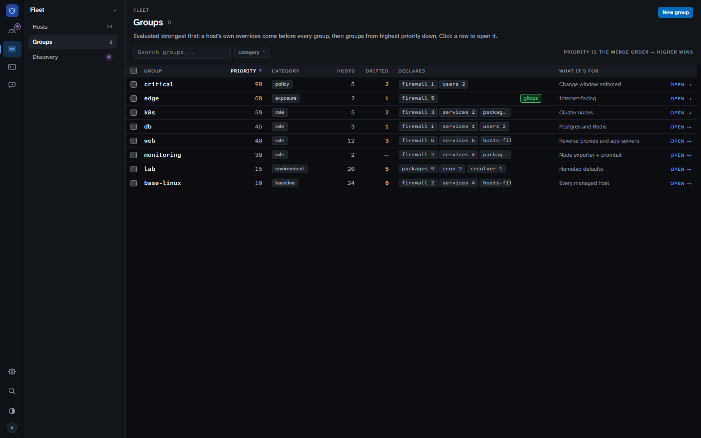
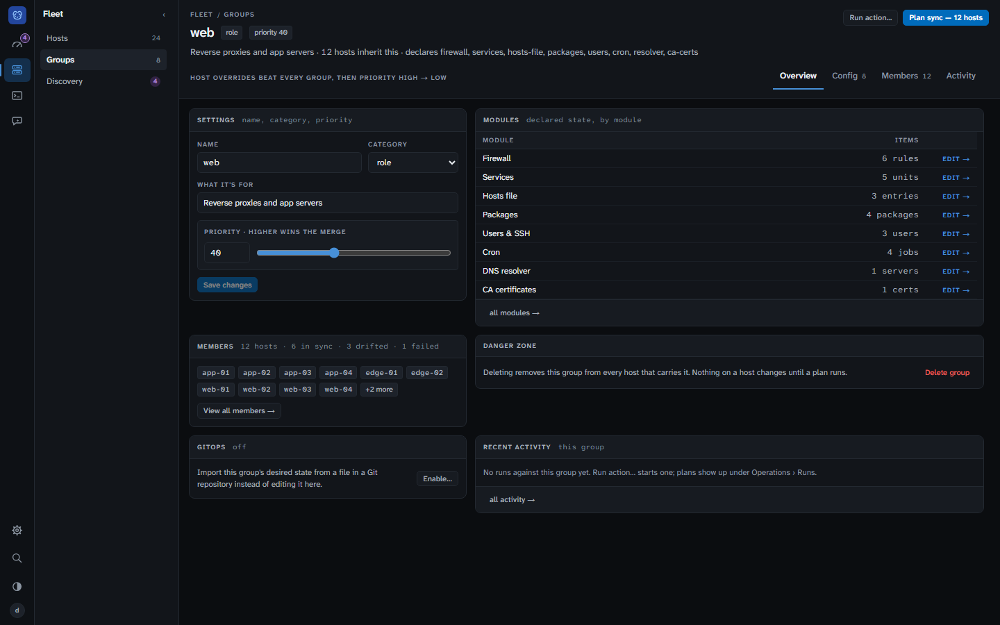
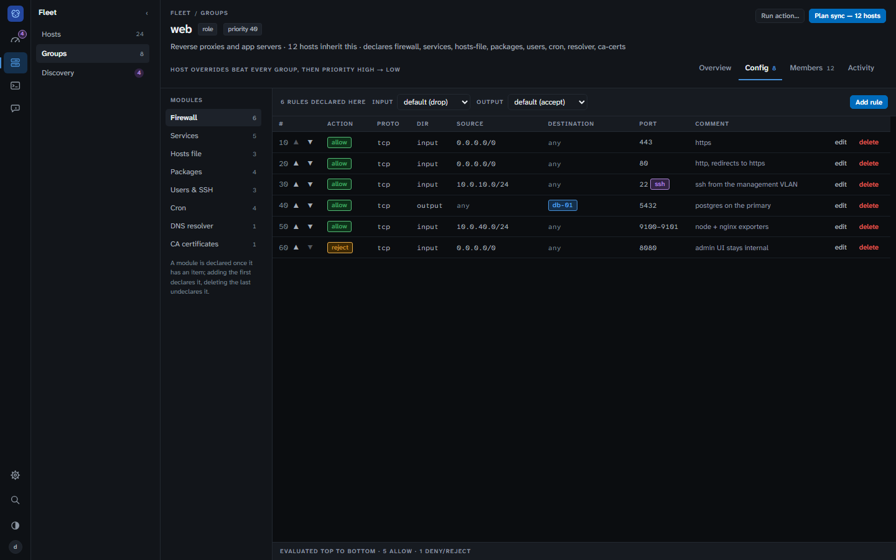
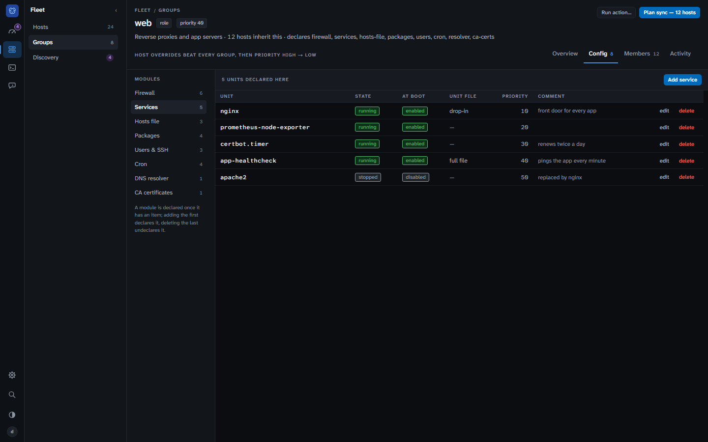
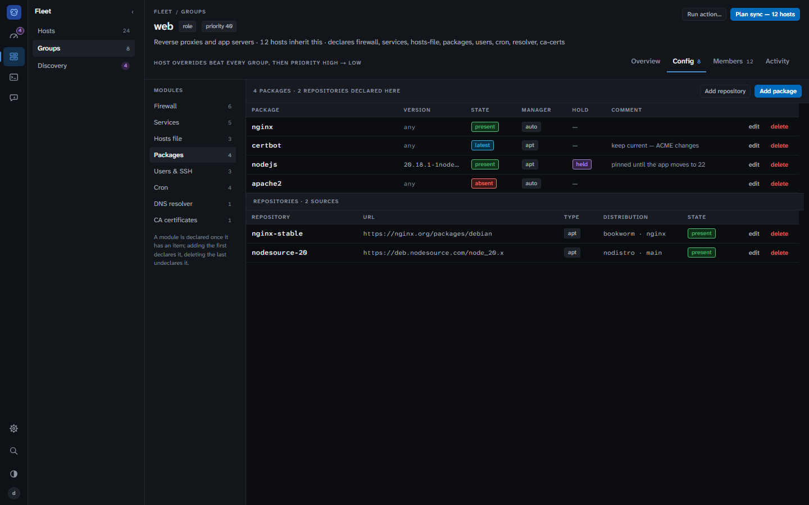
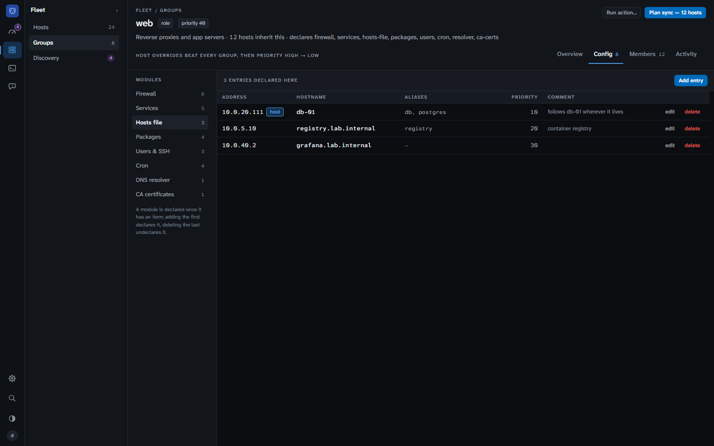
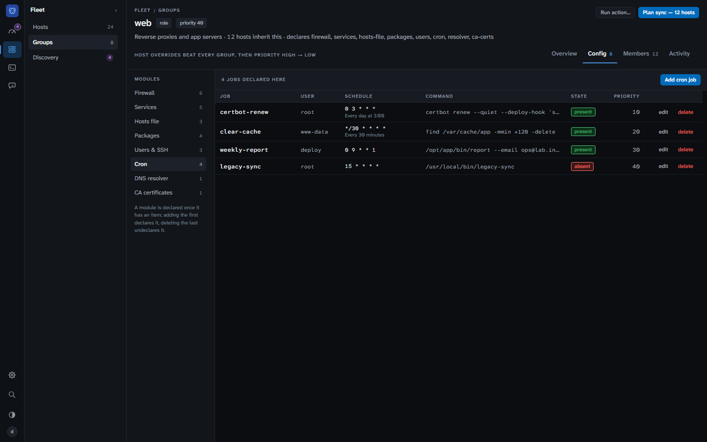
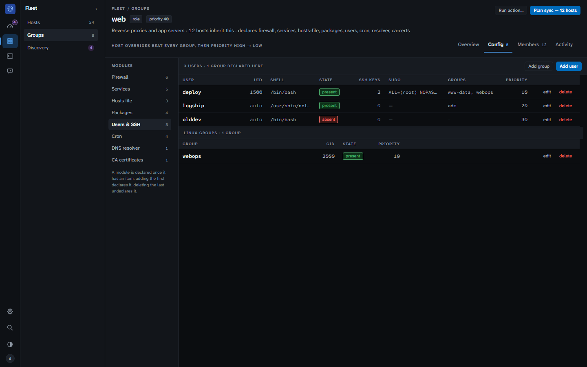
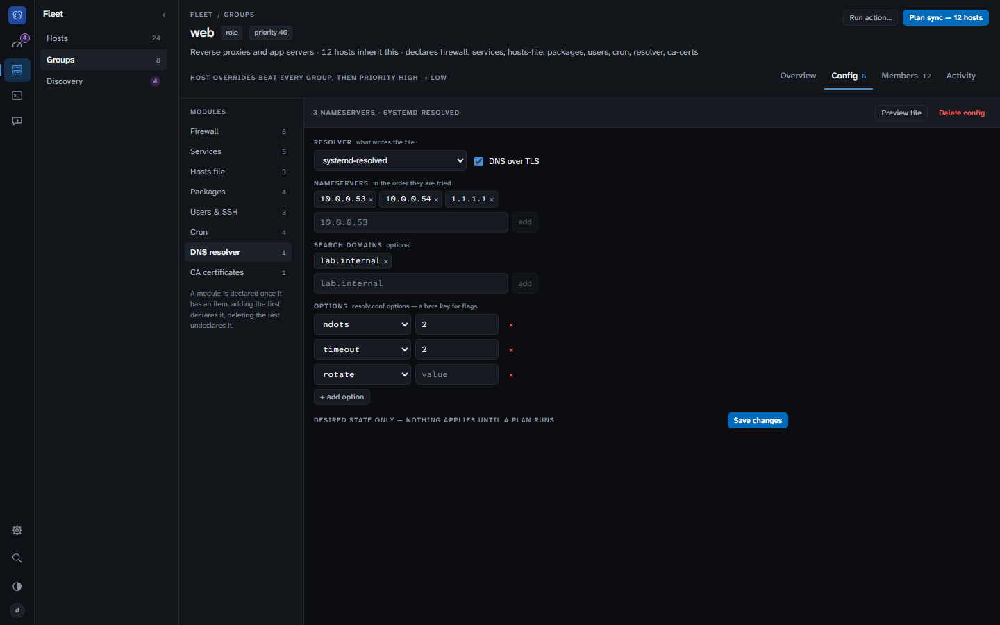

# Groups

## Groups List

**Path:** `/groups`

Groups are the core organisational unit in LabDog. Each group holds desired-state configuration for one or more modules. Hosts belong to groups, and when a host belongs to multiple groups, configurations are merged by priority (higher number wins).

### Columns

| Column | Description |
|--------|-------------|
| Group | Group name; the row opens the group's page |
| Priority | Higher number = higher precedence in merges — the list is sorted by it, strongest first |
| Category | Free label (`baseline`, `role`, `policy` …); the **category** filter narrows the list |
| Hosts | Number of hosts assigned to this group |
| Drifted | Members currently out of sync |
| Declares | Which modules have config in this group, with item counts — a tag opens that module's editor |
| GitOps | A **gitops** tag when the group imports from a Git repository, coloured by import status |
| What it's for | The group's one-line description |

The search box filters by name. Selecting rows enables **Delete selected** and, for a single group, **Plan sync**.

### Creating a Group

Click **New group**. The dialog shows the merge ladder — where the new group's priority lands among the existing ones — before you create it. Fields:

| Field | Notes |
|-------|-------|
| Name | Unique identifier for this group |
| Category | Optional label for visual grouping |
| What it's for | One line — why the group exists |
| Priority | `1`–`1000`, as a number or on the slider. Higher wins in merges. If the new priority changes who wins against another group on shared hosts, the dialog lists each flip. |
| Members | Hosts to add, from a filterable list |

A new group declares no modules; add its configuration on its page's Config tab. The command palette's **New group** opens a plain form at `/groups/new` (name, description, category, priority).

---

## Group Detail

**Path:** `/groups/{id}`

A group's own page, on the same pattern as [host detail](hosts.md#host-detail): a head with the group's name, category and priority (and a **gitops** tag when it imports from Git), then four tabs. Everything about a group is edited here, inline — there is no edit dialog.

The head offers **Run action…** (pick an action the group supports, preview or run it — see [Actions](actions.md)) and **Plan sync — N hosts**, which opens [Operations › Plans](operations.md#plans) scoped to the group.

### Overview

| Panel | What it does |
|-------|--------------|
| Settings | Name, category, description and priority, saved inline. Moving the priority shows a tie warning and **every winner/loser flip** the move causes — which other group this one starts beating or losing to, on how many shared hosts, for which modules — before you save. Nothing reaches a host until a plan runs. |
| Modules | The modules this group declares, with item counts. A row opens that module in the Config tab. |
| Members | The first hosts in the group and their sync summary (in sync · drifted · failed); **View all members →** opens the Members tab. |
| Danger zone | **Delete group** — two clicks (the second confirms with the number of hosts that drop the group). Hosts keep their other groups; nothing on a host changes until a plan runs. |
| GitOps | **Enable…** links a registered Git repository and file path; the group's desired state is then imported from that file and the module editors become read-only. Status, repository, file and last import are shown; **Disable GitOps** keeps the current items and stops importing. See [GitOps UI](gitops-ui.md). |
| Recent activity | The group's latest action runs; **all activity →** opens the Activity tab. |

### Config

The eight modules on the left — **Firewall**, **Services**, **Hosts file**, **Packages**, **Users & SSH**, **Cron**, **DNS resolver**, **CA certificates** — with item counts, and the selected module's editor on the right. A module is *declared* once the group has an item for it: adding the first item declares it, deleting the last undeclares it. The editors are documented below. The URL carries the selection (`?tab=config&module=firewall`), so a module's editor can be linked to directly; the command palette's *Firewall — group: web* entries land here.

With the Config tab open, **Plan sync** plans just that module.

### Members

The hosts that inherit this group — status, IP, their other groups (strongest first) and how many overrides of their own they carry. **+ add hosts** opens an inline picker (filter, tick a host to add it, or **add N** for everything that matches); **remove** drops a host from the group. Both change desired state only; the host re-merges on its next plan.

### Activity

**Runs** — every action run against the group, newest first; a row opens the run. **Schedules** — the group's [scheduled actions](scheduled-actions.md).

---

## Module editors

Each module's editor is the Config tab of the group's page
(`/groups/{id}?tab=config&module=<id>`). The old per-module URLs —
`/groups/{id}/rules`, `/services`, `/packages`, `/hosts-entries`,
`/cron-jobs`, `/users`, `/resolver`, `/ca-certs` — redirect there, and
`/groups/{id}/actions` redirects to the Activity tab.

Every editor has the same shape: a toolbar with the count of items
*declared here* (by this group — not what a host ends up with; a host's page
shows the merged result with where each item comes from), an **Add …**
button, and a table whose rows have **edit** and **delete**. Adding and
editing happen in a dialog. When the group imports from Git, the editors are
read-only — see [GitOps UI](gitops-ui.md).

Most items carry a **priority**. When two groups declare the same item for
a host, the higher-priority group's version wins; the item's own priority
breaks ties inside one group. See the
[Precedence guide](../examples/precedence/README.md).

## Firewall Rules

**Module:** `?tab=config&module=firewall`

The desired firewall state for every host in the group.

### Default policies

Two selects in the toolbar set the **input** and **output** default
policies: *default (drop)* / *drop* / *accept* for input, *default (accept)*
/ *accept* / *drop* for output. *default* means the group does not set one;
another group, or LabDog's default, decides.

### Rule table

| Column | Description |
|--------|-------------|
| # | Rules apply in this order. **▲** / **▼** move a rule up or down. |
| action | `allow`, `deny` or `reject` |
| proto | `tcp`, `udp`, `icmp` or `any` |
| dir | `input` or `output` |
| source | A CIDR, `any`, or a registered host — shown as a tag, resolved to the host's address at sync time |
| destination | As source |
| port | A port or range (`22`, `8000-8080`); an **ssh** tag marks port 22 |
| comment | Why the rule exists |

LabDog always injects its own SSH rule so it can never lock itself out; it
is not listed here, but it shows on every host's Firewall tab as *system*.
The **ssh** tag on a rule for port 22 is a reminder that this control-plane
rule is re-injected on apply whatever the group says.

### Adding a rule

**Add rule** asks for action, protocol, direction, source and destination —
each either a **CIDR** or a **Host** — ports (blank means all; *port end*
makes a range; hidden for `icmp` and `any`) and a comment.

---

## Services

**Module:** `?tab=config&module=services`

Which systemd services should be running or stopped, and enabled at boot or
not, on every host in the group.

| Column | Description |
|--------|-------------|
| unit | The systemd unit, e.g. `nginx` (`.service` optional) |
| state | `running` or `stopped` |
| at boot | Enabled or disabled |
| unit file | Whether the rule deploys a unit file, and which kind |
| priority | Used when groups disagree |
| comment | Optional note |

### Unit files

The **Add service** / **edit** dialog can attach a unit file:

- **Override existing** — a drop-in under
  `/etc/systemd/system/<unit>.service.d/labdog.conf`, applied only on hosts where the
  unit already exists.
- **New service (full file)** — deployed to
  `/etc/systemd/system/<unit>.service` on every host in the group.

---

## Packages

**Module:** `?tab=config&module=packages`

Two tables: packages and repositories.

### Packages

| Column | Description |
|--------|-------------|
| package | e.g. `nginx`, `postgresql-18`. The name cannot change once added — add a new rule instead. |
| version | Blank means any; otherwise a pinned version string |
| state | `present`, `latest` or `absent` |
| manager | `auto` (by OS family), `apt`, `dnf` or `yum` |
| hold | **held** pins the package at its installed version (apt `hold` / dnf `versionlock`) |
| comment | Optional note |

### Repositories

Custom APT or YUM/DNF repositories, added before packages are installed —
needed for anything outside the distribution's own repositories (PostgreSQL
PGDG, Docker CE…).

| Column | Description |
|--------|-------------|
| repository | Repository identifier |
| url | Repository base URL |
| type | `apt` or `yum` |
| distribution | APT codename and components (e.g. `bookworm main`) — APT only |
| state | `present` or `absent` |

The dialog also takes a GPG key URL.

---

## Hosts File

**Module:** `?tab=config&module=hosts-file`

`/etc/hosts` entries on every host in the group. An entry is either:

- **Literal address + name** — an IP address and a hostname, or
- **Registered host** — a LabDog host, written with its *current* address
  and name at sync time, so the entry follows the host when it moves.

| Column | Description |
|--------|-------------|
| address | IPv4 or IPv6, or the registered host it follows |
| hostname | The primary name for the entry |
| aliases | More names for the same address (comma-separated in the dialog) |
| priority | Decides between groups declaring the same hostname |
| comment | Optional note |

LabDog always keeps `127.0.0.1 localhost` and the host's own entry; they
cannot be removed from the UI.

---

## Cron Jobs

**Module:** `?tab=config&module=cron`

Scheduled tasks, deployed with `ansible.builtin.cron`.

| Column | Description |
|--------|-------------|
| job | Unique name for the job — how LabDog finds it again to update it |
| user | The Linux user it runs as |
| schedule | Five-field cron expression (`minute hour day month weekday`), with a plain-English reading |
| command | Shell command to run |
| state | `present` or `absent` |
| priority | Decides between groups declaring the same job |

The dialog reads the schedule back as you type (`0 2 * * *` → *daily at
02:00*) and takes **environment** variables — `KEY=value` pairs written
above the job — and a comment.

---

## Linux Users

**Module:** `?tab=config&module=users`

Two tables: users and groups.

### Users

| Column | Description |
|--------|-------------|
| user | Linux account name |
| uid | Numeric user ID; `auto` lets the OS assign one |
| shell | Login shell (e.g. `/bin/bash`, `/usr/sbin/nologin`) |
| state | `present` or `absent` |
| ssh keys | How many authorized public keys the user has |
| sudo | The user's sudoers line, if any |
| groups | Supplementary groups |
| priority | Decides between groups declaring the same user |

The dialog also takes a home directory (blank for the default), the
authorized keys (one per line), and a comment, which becomes the GECOS
field. A sudo rule is a sudoers line without the username, e.g.
`ALL=(ALL) NOPASSWD: ALL`.

### Groups

System groups (not LabDog groups), so users can be given supplementary
membership.

| Column | Description |
|--------|-------------|
| group | Linux group name |
| gid | Numeric group ID; `auto` lets the OS assign one |
| state | `present` or `absent` |
| priority | Decides between groups declaring the same Linux group |

---

## DNS Resolver

**Module:** `?tab=config&module=resolver`

The resolver configuration. It is a **singleton** — at most one per group
(or host). With none declared, hosts keep whatever DNS settings they have.

**Configure DNS** opens the form; once a configuration exists the form
shows it, with **Save changes**, **Preview file** (the file LabDog would
write) and **Delete config**.

| Field | Description |
|-------|-------------|
| resolver | What writes the configuration: `resolv.conf`, `systemd-resolved` or `NetworkManager` |
| nameservers | One or more addresses, in the order they are tried |
| search domains | Suffixes tried for short hostnames |
| options | resolv.conf options — `ndots`, `timeout`, `attempts`, `rotate`, `edns0`; a bare key for a flag |
| DNS over TLS | systemd-resolved only |

---

## CA Certificates

**Module:** `?tab=config&module=ca-certs`

Trusted certificate authorities, installed into the system trust store of
every host in the group, so they trust services signed by an internal CA.
Hosts can have their own too (host page → Config → CA certificates); they
merge with the group's.

| Column | Description |
|--------|-------------|
| certificate | The name you gave it (e.g. `Internal Root CA`) |
| subject | Parsed from the PEM |
| expires | The certificate's `notAfter` date, parsed from the PEM |
| sha-256 | The certificate's fingerprint — its identity |
| state | `present` (install) or `absent` (remove) |

**Add certificate** takes a display name, the PEM and a comment; subject,
issuer, expiry and fingerprint are read from the PEM. The **PEM cannot be
changed** afterwards — a different certificate has a different
fingerprint, so it is a new entry: add it, and remove the old one. **edit**
changes the name, state and comment. Set the state to `absent` to remove a
certificate from the hosts' trust store rather than just stop managing it.

Below the table, the most recent deployment runs show each host's outcome.

---

## Syncing changes

LabDog applies a group's desired configuration to its hosts over SSH,
always **preview-first**, on the [Plans](operations.md#plans) screen:

- **Plan sync — N hosts** on the group's page opens a plan scoped to the
  group (`/plans?scope=group:<id>`); from the Config tab it plans just the
  selected module (`&modules=firewall`).
- A plan can also be started from a host's page, or from Operations ›
  Plans with any set of hosts and modules.

### 1. Preview

Opening a plan runs a dry run on every host in scope: a per-host diff
between the desired state (stored in LabDog's database, merged across all
groups the host belongs to) and the current state fetched live over SSH.
Each host shows config to **add**, **remove** and leave **unchanged**;
hosts already in sync are flagged as such, hosts that cannot be reached are
skipped, not failed. A module whose current state could not be read is
shown as an error and is **never applied blind**.

### 2. Apply

Untick any host you want to leave behind; the blast radius and the
acknowledgements (hosts changing, an SSH-affecting rule, excluded hosts)
follow the selection, and **Review & apply…** arms only once you have
typed the host count. Each selected host then runs as a background job
through the unified per-host orchestrator: one Ansible playbook per host
covering every requested module, so two syncs targeting the same host
queue rather than race over SSH. LabDog generates the playbook from the
previewed diff, runs it via `ansible-runner`, updates the per-host and
per-module sync status, and writes an audit-log entry.

### Progress

The plan's URL is shareable, so a second pair of eyes can review before
anyone clicks Apply, and the screen follows every job to its per-host
result. Applied syncs are also tracked in the **global Sync tray** at the
bottom-right of every page — a live progress bar per operation, a per-host
and per-module drill-down, and a success/failure toast on completion. You
can navigate away while a sync runs; the tray keeps tracking until every
job reaches a terminal state.
