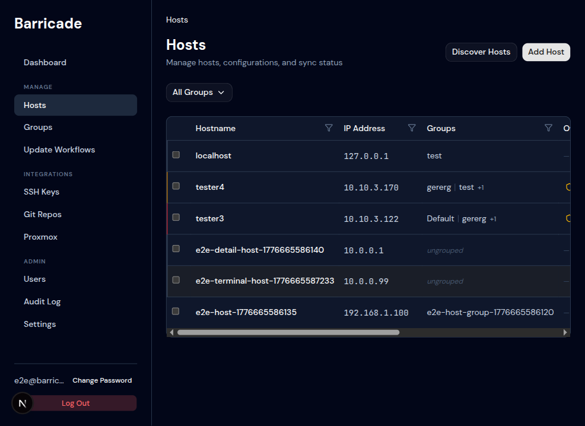
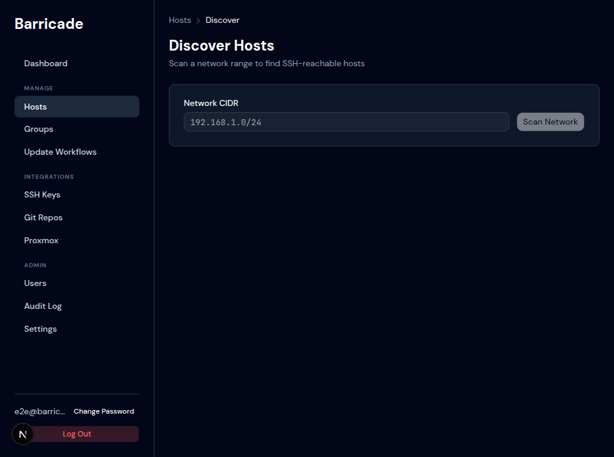

# Hosts

## Hosts List

**Path:** `/hosts`

Shows every host registered in LabDog. Columns:

| Column | Description |
|--------|-------------|
| Hostname | The name given to the host in LabDog |
| IP Address | Used for SSH connections and SSH-lockout rule generation |
| Groups | Which host groups this host belongs to |
| OS / Firewall | Detected firewall backend (`nftables`, `iptables`, `unknown`) |
| Sync Status | Current sync state badge |
| Actions | View detail, open terminal |

### Filtering

- **All Groups** dropdown — filter the table to hosts in a specific group.
- Column header filter icons — per-column text search.
- Bulk actions appear when rows are selected via checkboxes.

### Adding a Host

Click **Add Host**. Required fields:

| Field | Notes |
|-------|-------|
| Hostname | Display name — does not need to be the actual DNS name |
| IP Address | Must be reachable over SSH from the LabDog server |
| SSH User | User Ansible connects as (`root` by default) |
| SSH Port | Default 22 |
| SSH Key | One of the keys stored under SSH Keys |
| Firewall Backend | `nftables`, `iptables`, or `unknown` (auto-detect on first check) |

After adding, assign the host to one or more groups from the Groups page.

---

## Host Detail

**Path:** `/hosts/{id}`

Shows a single host's configuration, group memberships, and per-module sync status. From here you can:

- Edit the host's connection settings
- Enable or disable **drift detection** for this host
- Open the **SSH terminal**
- Trigger a **sync** for individual modules

### Module Status Table

Each module (firewall, services, packages, etc.) has its own row showing the last known sync state and when it was last checked.

---

## Discovery

**Path:** `/hosts/discover`

Scans a network CIDR range for hosts with port 22 open, then SSH-verifies each hit to confirm it's reachable with the selected key.

### Steps

1. Enter a CIDR range (e.g. `192.168.1.0/24`). Ranges larger than `/20` are blocked by default (configurable in [Settings](settings.md)).
2. Click **Scan Network**. The scan runs asynchronously — results appear as they arrive.
3. Review the hit list. Each row shows IP, resolved hostname (if available), and SSH verification status.
4. Select the hosts you want and click **Add Selected**. You'll be prompted to assign them to groups and choose a default SSH key.

The manual discovery page also shows an **"Automate this"** link pointing to the Scan Configs page (continuous scanning — coming soon).

---

## Terminal

**Path:** `/hosts/{id}/terminal`

A full browser-based SSH terminal powered by xterm.js. The connection goes through the LabDog server over a WebSocket — no direct SSH access from the browser is needed.

### Notes

- Sessions are subject to the idle timeout configured in [Settings](settings.md) (default 30 minutes).
- All terminal sessions are recorded in the [Audit Log](admin.md#audit-log) (session open/close events).
- The SSH user and key are the same ones configured on the host.
- Max concurrent sessions per user and globally are configurable in `dev/labdog.toml` or via environment variables (see `.env.example`).
