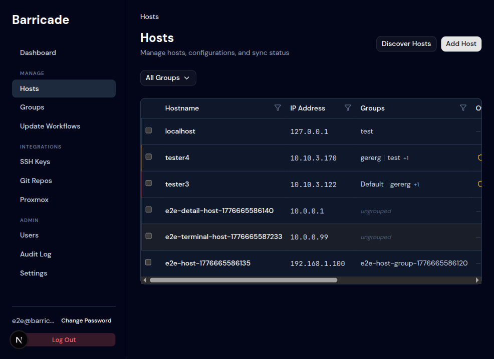
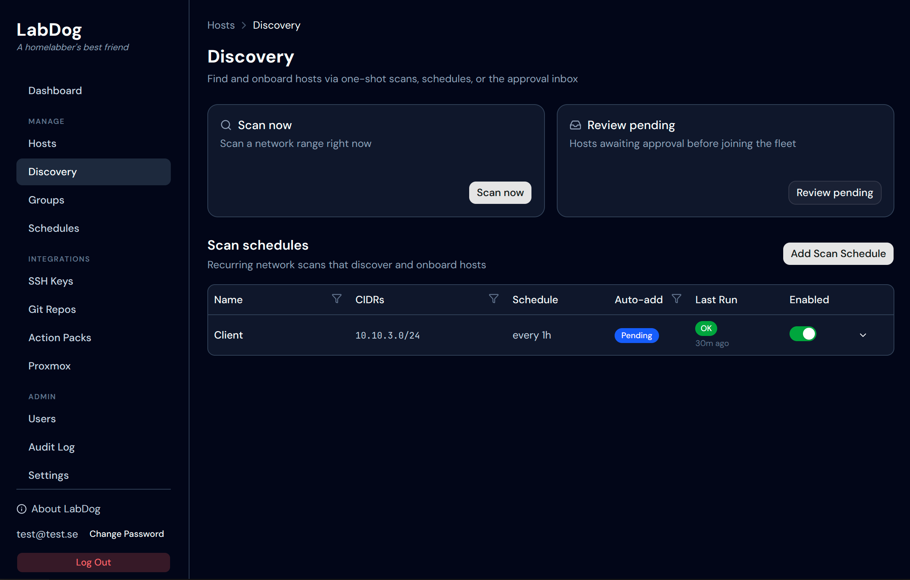

# Hosts

## Hosts List

**Path:** `/hosts`

Shows every host registered in LabDog. Columns:

| Column | Description |
|--------|-------------|
| Hostname | The name given to the host in LabDog |
| IP Address | Used for SSH connections and SSH-lockout rule generation |
| Groups | Which host groups this host belongs to |
| OS / Firewall | Detected firewall backend (`nftables`, `iptables`, `unknown`) |
| Proxmox | The mapped Proxmox VM/CT (name, VMID, node), or *Not mapped*. Shown only when at least one Proxmox node is configured. |
| Overrides | Count of host-level overrides per module |
| Sync Status | Current sync state badge |
| Actions | View detail, open terminal |

### Filtering

- **All Groups** dropdown — filter the table to hosts in a specific group.
- Column header filter icons — per-column text search.
- Bulk actions appear when rows are selected via checkboxes.

### Adding a Host

Click **Add Host**. Required fields:

| Field | Notes |
|-------|-------|
| Hostname | Display name — does not need to be the actual DNS name |
| IP Address | Must be reachable over SSH from the LabDog server |
| SSH User | User Ansible connects as (`root` by default) |
| SSH Port | Default 22 |
| SSH Key | One of the keys stored under SSH Keys |
| Firewall Backend | `nftables`, `iptables`, or `unknown` (auto-detect on first check) |

After adding, assign the host to one or more groups from the Groups page.

---

## Host Detail

**Path:** `/hosts/{id}`

Shows a single host's configuration, group memberships, and per-module sync status. From here you can:

- Edit the host's connection settings
- Enable or disable **drift detection** for this host
- Open the **SSH terminal**
- **Sync** an individual module or all modules at once — each opens a diff **preview** before applying, with live progress shown in the global sync tray
- View and discover the host's **Proxmox VM mapping**
- See **live CPU / memory / disk usage** when a Grafana backend is
  configured — see [Live host metrics](metrics.md)

### Module Status Table

Each module (firewall, services, packages, etc.) has its own row showing the last known sync state and when it was last checked.

### Firewall backend selection

LabDog manages **one** firewall backend per host — `nftables` or `iptables`
— shown as a badge next to **Effective Rules** on the host's **Rules** tab.
That badge is the store LabDog's **Sync** writes to and **Collect** reads
from; the other backend is left untouched.

**How the backend is chosen.** The value on the host's edit form is
authoritative: if you set it explicitly, LabDog never changes it, and once a
value has been detected it sticks. Auto-detection only runs while the backend
is still `unknown`. Because a modern host almost always has *both* the `nft`
and `iptables` binaries installed, detection uses a first-match ladder rather
than a simple "which is installed" check:

1. **Only one installed** → that one.
2. **Existing LabDog ruleset** — if LabDog already manages one backend on the
   host, keep it (prevents flip-flopping and orphaned rules).
3. **Container runtime** — Docker, kube-proxy in iptables mode, or nerdctl with
   CNI networking force **iptables**, which they hardcode and would otherwise
   fight. (This sits *below* step 2, so an established LabDog setup is never
   yanked out from under a container runtime.)
4. **Active ruleset** — whichever backend already has real input filtering
   configured wins.
5. **Default → nftables** on a greenfield host.

To pin a backend yourself, set **Firewall Backend** on the host's edit form.

### Dual-stack hosts (both firewalls installed)

Because the two firewalls are independent rule stores, a LabDog ruleset can be
left behind in the backend LabDog is *not* managing — for example after
switching backends, or after manually editing rules on the host. Collection
only ever reads the active backend, so those leftover rules would be invisible
in **Current State** yet could still filter traffic.

LabDog handles this in two ways:

- **Every firewall sync tears down LabDog's footprint in the inactive
  backend** — dropping the `LABDOG-INPUT`/`LABDOG-OUTPUT` iptables chains, or
  deleting the LabDog-owned nftables `inet filter` table — so there is a single
  source of truth. Only LabDog's own rules are removed; Docker, kube-proxy, and
  firewalld rules are left intact.
- **Collect warns when it detects a competing LabDog ruleset** in the inactive
  backend (e.g. *"nftables is the active backend, but LabDog-managed iptables
  rules are still present"*). Run **Sync Rules** to clear it.

> Note: flushing the iptables `LABDOG-INPUT` chain on a host LabDog manages via
> **nftables** does nothing to the live ruleset — the rules live in the
> nftables `inet filter` table. Check the backend badge on the Rules tab if a
> manual firewall change isn't reflected after **Collect**.

### Proxmox VM Mapping

When one or more Proxmox nodes are configured under [Proxmox Settings](settings.md), the host detail page shows a **VM Mapping** panel. The mapping links this host to its backing Proxmox VM or LXC container (VM name, VMID, and Proxmox node) — this is what enables automatic snapshot + rollback for destructive [actions](actions.md).

Click **Discover** to scan the configured Proxmox nodes and match this host to a VM/CT automatically. If no mapping is found the panel shows *No VM mapping found*, and destructive actions on this host run without snapshot protection. To map every host in one pass, use **Discover VM Mappings** on the [Proxmox Settings](settings.md) page.

---

## Discovery

**Path:** `/discovery`

Scans a network CIDR range for hosts with port 22 open, then SSH-verifies each hit to confirm it's reachable with the selected key.

### Steps

1. Enter a CIDR range (e.g. `192.168.1.0/24`). Ranges larger than `/20` are blocked by default (configurable in [Settings](settings.md)).
2. Click **Scan Network**. The scan runs asynchronously — results appear as they arrive.
3. Review the hit list. Each row shows IP, resolved hostname (if available), and SSH verification status.
4. Select the hosts you want and click **Add Selected**. You'll be prompted to assign them to groups and choose a default SSH key.

The manual discovery page also shows an **"Automate this"** link pointing to the Scan Configs page (continuous scanning — coming soon).

---

## Terminal

**Path:** `/hosts/{id}/terminal`

A full browser-based SSH terminal powered by xterm.js. The connection goes through the LabDog server over a WebSocket — no direct SSH access from the browser is needed.

### Notes

- Sessions are subject to the idle timeout configured in [Settings](settings.md) (default 30 minutes).
- All terminal sessions are recorded in the [Audit Log](admin.md#audit-log) (session open/close events).
- The SSH user and key are the same ones configured on the host.
- Max concurrent sessions per user and globally are configurable in `dev/labdog.toml` or via environment variables (see `.env.example`).
