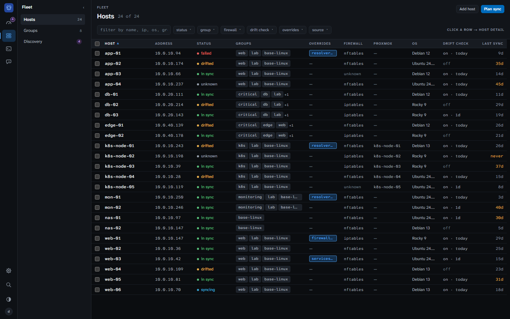
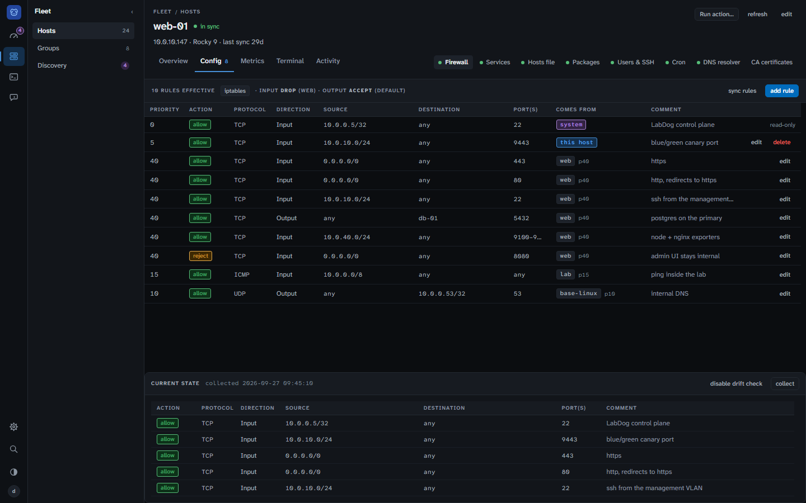
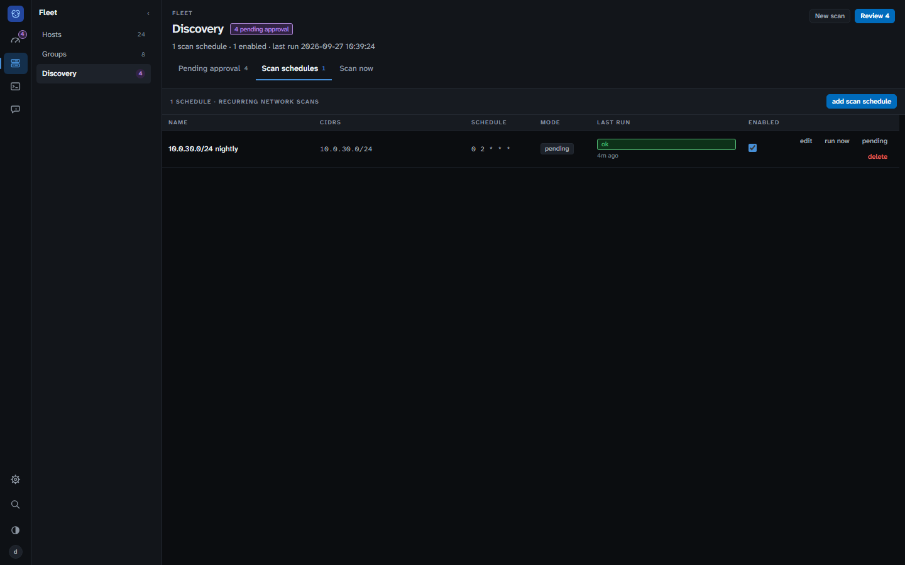
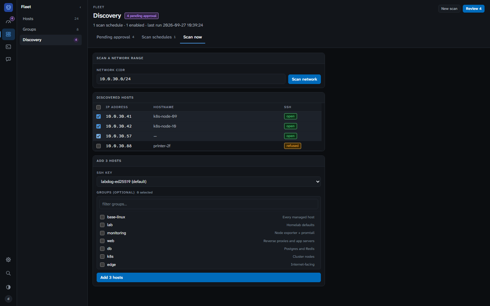

# Hosts

## Hosts List

**Path:** `/hosts` (Fleet · Hosts)

Every host registered in LabDog, one row each. Click a row to open the
host's page.

| Column | Description |
|--------|-------------|
| host | The name given to the host in LabDog |
| address | Used for SSH connections and SSH-lockout rule generation |
| status | Sync state — in sync, drifted, syncing, failed, unknown |
| groups | The groups this host belongs to, as chips in priority order; hover a chip for its priority |
| overrides | One chip per module that has host-level overrides, with the count |
| firewall | Detected firewall backend (`nftables`, `iptables`, `unknown`) |
| proxmox | The mapped Proxmox VM or container, if any. Shown only when at least one Proxmox node is configured. |
| os | Operating system, from the last collection |
| drift check | `on` / `off`, with when the host was last checked |
| last sync | How long ago the host was last synced |

### Filtering and bulk actions

- The search box filters by name, address, OS or group.
- The chips beside it filter by **status**, **group** (or *ungrouped*),
  **firewall**, **drift check**, **overrides**, and — when Proxmox is
  configured — **source** (Proxmox guest or not). **clear** resets them.
  Each option shows how many hosts it matches.
- Tick rows to open the bulk bar: **Enable drift check**, **Disable drift
  check**, **Delete selected**. Each asks for confirmation.

**Plan sync** (top right) opens [Plans](operations.md#plans).

### Adding a host

**Add host** opens `/hosts/new`:

| Field | Notes |
|-------|-------|
| hostname | Display name — does not need to be the DNS name. Leave it empty to take the name the host reports over SSH. |
| ip address | Must be reachable over SSH from the LabDog server |
| ssh port | Default 22 |
| ssh user | The user Ansible connects as; default `root` |
| ssh key | One of the keys under [SSH Keys](admin.md#ssh-keys); the default key is marked |
| groups | A checkbox list of every group, in priority order. Membership decides the configuration the host receives on its first sync. |
| Check this host for drift | On by default. LabDog connects on a timer and reports where the host has diverged from its desired configuration — read-only. |

The firewall backend is detected, not chosen — see
[Firewall backend selection](#firewall-backend-selection).

---

## Host Detail

**Path:** `/hosts/{id}`

The head shows the hostname, its sync status, address, OS and last sync.
Five tabs sit under it — **Overview**, **Config**, **Metrics**, **Terminal**
and **Activity** — the same shape as a [group's page](groups.md#group-detail).

Buttons in the head:

- **Run action…** — pick any action that supports a host, then preview
  (dry-run) or run it. See [Actions](actions.md).
- **refresh** — reload the current tab's data.
- **collect all** and **sync all** (Overview tab) — read every module's live
  state from the host, or open a diff preview of every module and apply it.
  Progress shows in the global sync tray.
- **trust new host key** (Overview tab, only when the stored SSH host key has
  been cleared or never recorded) — accept whatever key the host presents on
  the next connection. Use it after reinstalling a host; otherwise a changed
  key means something is wrong.
- **edit** — hostname, address, SSH port, user and key.

### Overview

- **host** — address, SSH port, the management IP LabDog connects from,
  firewall backend, sync status, last sync, last drift check, OS, kernel and
  default NIC. **drift monitoring** is a toggle: click it to turn this host's
  drift check on or off. This is the host-level flag, which governs
  *firewall* drift only — the other six modules each have their own toggle
  on their Config tab. See [Drift detection](drift-detection.md).
- **group memberships** — the groups this host is in, with category,
  priority and description. **+ add to group** opens a filterable picker
  in place; **remove** takes the host out of one group.
- **vm mapping** — shown when a Proxmox node is configured; see
  [Proxmox VM mapping](#proxmox-vm-mapping).

### Config

The eight modules — Firewall, Services, Hosts file, Users, Cron, Packages,
CA certificates and DNS resolver — are listed across the tab bar, each with a
dot for its sync state. Every module has the same layout as a group's
[Config tab](groups.md#group-detail):

- A toolbar with the count of effective items, **sync** for that module (a
  diff preview first) and **add** for a host override.
- The **effective** table: every item this host receives, whichever group it
  comes from, with a **comes from** column — the group and its priority,
  *this host*, or *system* for LabDog's own SSH rule. Editing a group's item
  creates a host override of it; host rows can be edited or deleted.
- **current state** — what the last collection read from the host, with
  **collect** to read it again and **enable/disable drift check** for that
  module (on Firewall this is the host-level flag — see
  [Drift detection](drift-detection.md#the-two-flags)). CA certificates have
  neither.

Services adds a live inventory below: **load inventory** lists every unit on
the host, with **start**, **stop** and **restart** (each confirmed), **edit**
(opens the override dialog with the unit's on-disk state) and **remove** for
an override.

### Metrics

Instant CPU, memory and disk usage from a Grafana Mimir backend. Until
that works, the tab says what is missing — no Mimir instance, no default
one, or no data from this host yet — and links to the fix. See
[Live host metrics](host-metrics.md#states-you-may-see).

### Terminal

An SSH terminal into the host, in place — see [Terminal](#terminal).

### Activity

**Actions** — the actions available for this host and its recent runs — and
**Schedules**, the schedules that target it. See [Actions](actions.md) and
[Scheduled actions](scheduled-actions.md).

### Firewall backend selection

LabDog manages **one** firewall backend per host — `nftables` or `iptables`
— shown as a tag in the Config › Firewall toolbar and in the Overview tab's
host facts. That backend is the store **sync** writes to and **collect**
reads from; the other backend is left untouched.

**How the backend is chosen.** Auto-detection runs while the backend is
still `unknown`; once a value has been detected it sticks. Because a modern
host almost always has *both* the `nft` and `iptables` binaries installed,
detection uses a first-match ladder rather than a simple "which is
installed" check:

1. **Only one installed** → that one.
2. **Existing LabDog ruleset** — if LabDog already manages one backend on the
   host, keep it (prevents flip-flopping and orphaned rules).
3. **Container runtime** — Docker, kube-proxy in iptables mode, or nerdctl with
   CNI networking force **iptables**, which they hardcode and would otherwise
   fight. (This sits *below* step 2, so an established LabDog setup is never
   yanked out from under a container runtime.)
4. **Active ruleset** — whichever backend already has real input filtering
   configured wins.
5. **Default → nftables** on a greenfield host.

The UI has no backend picker. To pin one yourself, set it through the API —
`PUT /api/hosts/{id}` with `{"firewall_backend": "iptables"}` — and LabDog
never changes it after that. While the backend is still `unknown`, the
Firewall tab offers to install nftables — it adds a host package override
for `nftables`, runs a package sync, then detects the backend again.

### Dual-stack hosts (both firewalls installed)

Because the two firewalls are independent rule stores, a LabDog ruleset can be
left behind in the backend LabDog is *not* managing — for example after
switching backends, or after manually editing rules on the host. Collection
only ever reads the active backend, so those leftover rules would be invisible
in **current state** yet could still filter traffic.

LabDog handles this in two ways:

- **Every firewall sync tears down LabDog's footprint in the inactive
  backend** — dropping the `LABDOG-INPUT`/`LABDOG-OUTPUT` iptables chains, or
  deleting the LabDog-owned nftables `inet filter` table — so there is a single
  source of truth. Only LabDog's own rules are removed; Docker, kube-proxy, and
  firewalld rules are left intact.
- **Collect warns when it detects a competing LabDog ruleset** in the inactive
  backend (e.g. *"nftables is the active backend, but LabDog-managed iptables
  rules are still present"*). Run **sync rules** to clear it.

> Note: flushing the iptables `LABDOG-INPUT` chain on a host LabDog manages via
> **nftables** does nothing to the live ruleset — the rules live in the
> nftables `inet filter` table. Check the backend tag in the Firewall toolbar
> if a manual firewall change isn't reflected after **collect**.

### Proxmox VM Mapping

When one or more Proxmox nodes are configured under
[Hypervisors](settings.md#proxmox-settings), the Overview tab shows a **vm
mapping** panel. The mapping links this host to its backing Proxmox VM or LXC
container (VM name, VMID and node) — this is what enables automatic
snapshot + rollback for destructive [actions](actions.md).

**discover** scans the configured Proxmox nodes and matches this host to a VM
or container. If no mapping is found the panel says so, and destructive
actions on this host run without snapshot protection. To map every host in
one pass, use **Discover VM mappings** on the
[Hypervisors](settings.md#proxmox-settings) page.

---

## Discovery

**Path:** `/discovery` (Fleet · Discovery)

Discovery finds hosts on the network and queues them for approval. Nothing
joins the fleet until you approve it. The page has three tabs; **New scan**
and **Review** in the head jump to *Scan now* and *Pending approval*.

The old URLs redirect here: `/hosts/discover` → Scan now,
`/hosts/discovery` and `/hosts/scans` → Scan schedules, `/hosts/pending` and
`/hosts/scans/{id}/pending` → Pending approval.

### Pending approval

Hosts found by scan schedules, waiting for a decision — address, hostname,
the schedule that found them, when, and whether SSH verified. Tick rows,
then **approve selected** or **dismiss selected**. Approving adds the host
with the schedule's default groups — which is what decides the configuration
it receives on its first sync. A schedule's **pending** link opens this tab
filtered to that schedule (`/discovery?tab=pending&scan={id}`).

### Scan schedules

Recurring scans. Each row shows the CIDRs, the schedule, the mode (**auto**
adds what it finds; **pending** queues it for approval), the last run and an
**enabled** checkbox, with **edit · run now · pending · delete**.

**run now** queues the scan and a toast reports the result when it finishes:
how many hosts it added, how many are waiting in *Pending approval* (with a
**View hosts** and/or **Review** button), that it found nothing new, or why
it failed. A run that takes longer than two minutes, because the range is
large or it waits for one of the four scan slots, gets a "still running"
toast first and its result later. The toasts appear only while you stay on
this tab; the *last run* column always shows the outcome. Unlike a
scheduled run, **run now** also reports hosts you dismissed from *Pending
approval* again. It is unavailable while the schedule is disabled.

**add scan schedule** asks for a name, one or more CIDRs, the SSH key and
port to verify with, default groups, a schedule (every *n*
minutes/hours/days, or a cron expression), and whether to add discovered
hosts automatically.

### Scan now

A one-off scan:

1. Enter a CIDR (e.g. `192.168.1.0/24`). Ranges larger than `/20` are
   refused by default — the limit is `discovery.min_prefix` in
   `labdog.toml` (`LABDOG_DISCOVERY__MIN_PREFIX`).
2. **Scan network** probes every address for an open port 22, except the
   ones that are already hosts in LabDog. A meter shows progress; results
   arrive as the scan runs. The result names the addresses it left out, so
   a host a scan schedule added a minute ago is not mistaken for a miss.
3. **discovered hosts** lists each hit with its address, resolved hostname
   and SSH status. Tick the ones you want.
4. In **add *n* hosts**, pick the SSH key and, optionally, groups, then
   **Add *n* hosts**. The result says how many were added, skipped (already
   managed) or failed.

---

## Terminal

**Path:** `/hosts/{id}/terminal`, or the host page's **Terminal** tab

A full browser-based SSH terminal powered by xterm.js. The connection goes
through the LabDog server over a WebSocket — no direct SSH access from the
browser is needed.

### Notes

- Sessions close after the idle timeout (`ssh.idle_timeout_seconds` in
  [Settings](settings.md), default 30 minutes).
- All terminal sessions are recorded in the [Audit Log](operations.md#audit)
  (session open/close events).
- The SSH user and key are the same ones configured on the host.
- Concurrent sessions per user and in total are capped in `labdog.toml`
  (`[ssh] max_sessions_per_user`, `max_total_sessions`) or the matching
  `LABDOG_SSH__…` environment variables (see `.env.example`).
