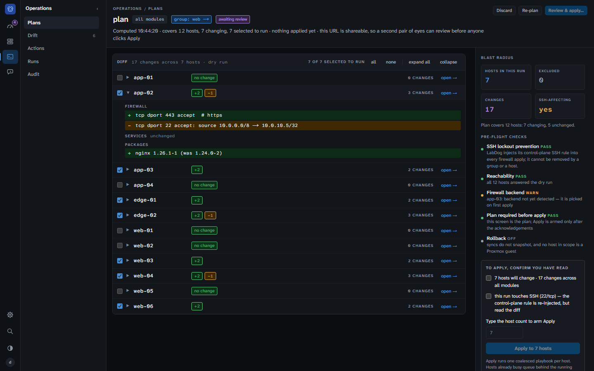

# Operations

The Operations zone holds the things that *happen* to the fleet: plans,
drift findings, actions, runs and the audit trail. The rule the zone is
built on: an operation you start is contextual (every **Plan sync** button
in the app lands here), and an operation that happened is an object with a
URL.

## Plans

**Path:** `/plans`, `/plans?scope=group:<id>&modules=firewall,services`,
`/plans?hosts=1,2,3`

Plan → apply as a screen rather than a dialog. A plan is a scope (a group,
or a hand-picked set of hosts) and a set of modules.

1. **Define** — pick a group or tick hosts, tick the modules (all seven
   sync modules by default; CA certificates are applied by their own action
   and are not part of a plan). **Compute plan** runs the dry run.
2. **Review** — every host in scope gets a row: `+n −n ~n` change counts,
   *no change*, *skipped* (no SSH key — skipped, not failed) or *preview
   failed*. Expand a row for the per-module diff. Each changing host has a
   checkbox; the blast radius, the acknowledgements and the run itself are
   derived from that **selection**, so a partial run is never described with
   the whole plan's numbers. Pre-flight checks on the right: SSH lockout
   prevention, reachability, firewall backend detection, and whether
   rollback is possible. Apply is armed only after ticking every
   acknowledgement and typing the number of hosts that will change.
3. **Apply** — one coalesced playbook per selected host, queued through the
   per-host serialisation so a busy host waits its turn. The screen polls the
   jobs and shows each host's outcome; the global sync tray follows along.
4. **Result** — applied / failed / excluded / unchanged / skipped, a card
   per failed host with the error and a jump to the host or the assistant,
   and **Plan the remaining** when hosts were excluded.

The URL carries the definition, so a second pair of eyes can open exactly
the same plan and see the same diff before anyone clicks Apply. **Re-plan**
recomputes; **Discard** starts over.

## Drift

**Path:** `/drift`

What the fleet actually looks like versus what it was told to look like, as
a findings list. A finding is one (host, module) whose last collection
disagreed with desired state; a failed collection is a high-severity
finding of its own. Group by host or by module, filter by severity.

- **Remediate** writes a plan for exactly that host and module (or every
  finding in the panel) — nothing here applies anything directly.
- **Re-check** queues a state collection for the host(s); **Re-check fleet**
  does it for everyone.
- **Inspect** opens the host's Config tab on that module to compare desired
  and effective state.

When drift checking is off on every host the page says so instead of
showing an empty list as good news. See [drift detection](drift-detection.md)
for what a check is and the two `drift_check_enabled` flags.

## Actions

**Path:** `/actions` (`?tab=library|packs|schedules`)

- **Library** — every registered action (pack-supplied; built-ins are not
  listed), its pack, what it does, whether it is destructive, contested
  (*unresolved* — pick a winning pack under Packs first) or re-syncs
  modules afterwards, and how often it has run. **run…** asks for a host or
  group target and then opens the run dialog; **schedule…** opens the
  schedule wizard preselected on the action.
- **Packs** — the pack registry and its sources, with per-key resolution
  when two packs contribute the same action. The former `/action-packs`
  page redirects here. See [Action packs](actions.md#action-packs).
- **Schedules** — cron-driven runs of any action. The former `/schedules`
  page redirects here. See [Scheduled actions](scheduled-actions.md).

## Runs

**Path:** `/runs`

One stream, newest first: sync jobs (applies), action runs, scheduled runs
and state collections, with kind and status filters. A run with a page of
its own (action runs, including scheduled ones) opens it; a sync job opens
its host. The last 100 of each source.

## Audit

**Path:** `/audit`

An append-only record of every change made through LabDog. Events come
from API writes (hosts, groups and every module's items, Git repositories,
action packs, SSH keys, settings…), sync and action runs (ad-hoc and
scheduled), discovery, assistant commands, and terminal sessions.

Most entries are a plain verb on a typed object — `create`, `update` or
`delete` of a `host`, a `host_group`, a `package_rule`, a `scan_config` —
and the rest name a domain event: `sync_triggered` / `sync_completed` /
`sync_failed`, `scheduled_action.dispatched`, `gitops.import.firewall`,
`ai_command`, `session_start` / `session_end`, `trust_host_key`.

Sync events come in pairs: `sync_triggered` (at API entry — records the
operator's intent and the requested `module_filter`) and `sync_completed` or
`sync_failed` (when the orchestrator finishes — a `{module: outcome}` payload
covering every module that ran). One pair per sync job, whether it covered
every module or one.

| Column | Description |
|--------|-------------|
| when | When it happened |
| user | The acting user's email; `system` for events nobody started, like scheduled drift checks |
| action | What happened (`create`, `sync_triggered`, `session_start` …), coloured by kind |
| entity | What it happened to, as type and id (`host group #4`, `ssh session #…`) |
| ip address | Where the request came from |

Each entry also stores the object's state before and after the change
(JSON, secrets scrubbed). The screen lists the entries; the full record is
available from the API (`GET /api/audit-log`).

### Filtering

The search box matches user, entity or IP address; the **from** / **to**
dates and the **action** and **entity** chips narrow further. All of them
apply to the entries loaded so far — **load more** fetches the next 100.

### SSH session transcripts

A `session_start` entry for a terminal session has **view transcript**,
which opens what the operator typed during the session (stdin only — not
the host's output).

### Retention

Entries — and terminal transcripts — older than the retention period are
pruned daily. The period is `logging.audit_retention_days` in
[Settings](settings.md) (default 90 days; `0` keeps them forever).
